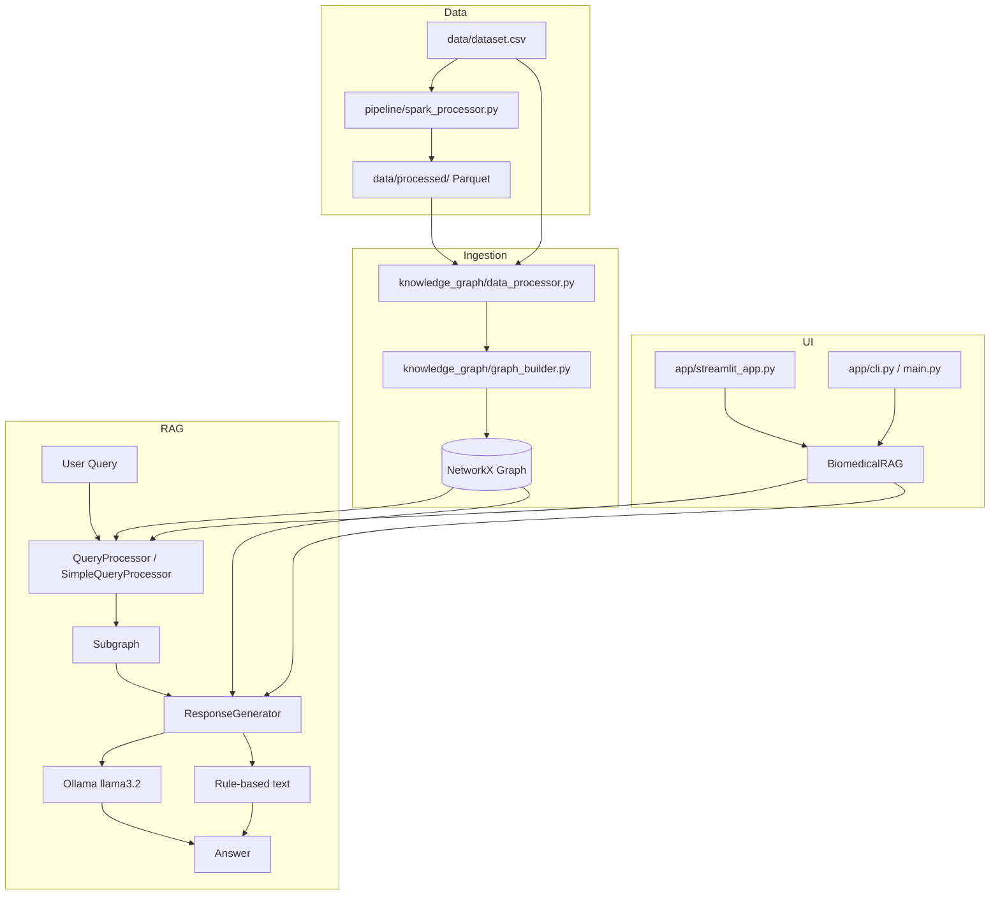

# BioRAG — Codebase Analysis Report

BioRAG is a **biomedical Retrieval-Augmented Generation (RAG)** application. It loads disease–symptom data from CSV or Parquet, builds a **NetworkX knowledge graph**, retrieves a relevant subgraph for each natural-language question, and answers using **Ollama (llama3.2)** with **rule-based fallbacks** when the LLM or PyTorch stack is unavailable.

---

## 1. How the system works (end-to-end)

### Typical runtime path

1. **Data source**: `app/streamlit_app.py` and `main.py` call `preprocess_data()`. If `data/processed/` exists, Parquet is used; otherwise `data/dataset.csv`.
2. **Graph build**: `build_graph()` creates nodes labeled `Disease` or `Symptom` and edges typed `HAS_SYMPTOM`.
3. **Query**: `BiomedicalRAG.answer_query()` → `QueryProcessor.process_query()` finds matching diseases/symptoms (direct, fuzzy, or semantic) and returns a **1-hop subgraph**.
4. **Response**: `ResponseGenerator.generate_response()` pulls disease→symptom context, formats it, and calls Ollama; on failure, `_generate_rule_based_response()`.
5. **Fallback chain**: Advanced `QueryProcessor` (sentence-transformers) → `SimpleQueryProcessor` (text only) if import/DLL fails; LLM → rules if Ollama fails.

### Optional preprocessing

`pipeline/spark_processor.py` cleans CSV with Spark and writes Parquet (Spark write, or Pandas/PyArrow on Windows when Hadoop/winutils is missing).

---

## 2. Repository layout

| Path | Role |
|------|------|
| `main.py` | Entry: CLI or launch Streamlit UI |
| `config.py` | Central constants (paths, thresholds, UI) |
| `run_ui.py` | Root-level Streamlit launcher |
| `app/` | CLI, Streamlit UI, `run_ui.py` |
| `knowledge_graph/` | Data load, graph build, embeddings, schema |
| `rag/` | RAG orchestration, query + response |
| `pipeline/` | PySpark CSV → Parquet |
| `data/` | `dataset.csv` (+ optional `processed/`) |
| `tests/` | Pytest suite |
| `docs/` | README, testing guide, UI notes |

**Note:** `knowledge_graph/neo4j_builder.py` is **fully commented out** (no active code). `data_exploration.py` is a **standalone script** (no functions).

---

## 3. Configuration (`config.py`)

No functions. Module-level settings:

| Constant | Purpose |
|----------|---------|
| `DATA_PATH` | Default processed data dir |
| `LLM_MODEL`, `LLM_ENABLED` | Ollama model and toggle |
| `GRAPH_LAYOUT_ITERATIONS`, `GRAPH_SPRING_K` | Graph layout |
| `SEMANTIC_SIMILARITY_THRESHOLD`, `FUZZY_MATCH_THRESHOLD`, `MAX_TOP_MATCHES` | Query tuning (not all wired into processors) |
| `STREAMLIT_*`, `NODE_COLORS`, `NODE_SIZES` | UI |
| `DEBUG_MODE`, `LOG_LEVEL` | Dev |

---

## 4. Application layer

### `main.py`

| Function | Description |
|----------|-------------|
| `main()` | Parses `--mode` (`cli` \| `ui`) and `--port`. **UI**: subprocess `streamlit run app/streamlit_app.py`. **CLI**: checks `data/dataset.csv`, runs `preprocess_data` → `build_graph` → `BiomedicalRAG` → `CLI.run()`. |

### `run_ui.py` (repo root)

| Function | Description |
|----------|-------------|
| `main()` | Launches Streamlit on `app/streamlit_app.py` (port 8501). Handles Ctrl+C and errors. |

### `app/run_ui.py`

| Function | Description |
|----------|-------------|
| `main()` | Same as root launcher but resolves `streamlit_app.py` next to `app/` and sets `cwd` to project root. |

### `app/cli.py` — class `CLI`

| Method | Description |
|--------|-------------|
| `__init__(rag_system)` | Stores `BiomedicalRAG` instance. |
| `run()` | REPL: read questions until `exit`/`quit`; prints `rag_system.answer_query(query)`. |

### `app/streamlit_app.py`

| Function | Description |
|----------|-------------|
| `_get_data_path()` | Returns `("data/processed", Parquet label)` if dir exists, else `("data/dataset.csv", CSV label)`, else `(None, None)`. |
| `initialize_system()` | Loads data, builds graph, creates `BiomedicalRAG`, stores in `st.session_state` (`rag_system`, `graph`, `data_source`). |
| `create_interactive_graph(graph, show_diseases, show_symptoms, search_term)` | Plotly network: spring layout, filter node types, search with 1-hop neighborhood highlight, edges between visible nodes. |
| `knowledge_graph_page()` | Streamlit page: sidebar filters/search/stats, Plotly chart, top diseases list. |
| `qa_page()` | Q&A UI, example buttons, query history with search/delete. |
| `main()` | Sidebar navigation (`Knowledge Graph` / `Q&A Interface`), system status, routes to pages. |

---

## 5. Knowledge graph package

### `knowledge_graph/schema.py` — class `GraphSchema`

Constants only (no methods):

- Node labels: `DISEASE`, `SYMPTOM`
- Edge types: `HAS_SYMPTOM`, `SYMPTOM_OF`
- Properties: `NAME`, `DESCRIPTION`, `SEVERITY`, `EMBEDDING`

### `knowledge_graph/data_processor.py`

| Function | Description |
|----------|-------------|
| `preprocess_data(data_path)` | Reads CSV or Parquet directory. Extracts unique `Disease` values, all `Symptom_*` columns, builds `relationships` list `{source, target, type: HAS_SYMPTOM}`. Returns `(diseases, symptoms, relationships)`. |

### `knowledge_graph/graph_builder.py`

| Function | Description |
|----------|-------------|
| `build_graph(diseases, symptoms, relationships)` | Creates undirected `nx.Graph`: disease nodes (`label=Disease`), symptom nodes (`label=Symptom`), edges with `type`. |
| `visualize_graph(G, output_path)` | Matplotlib spring layout: red diseases, blue symptoms, saves PNG (default `knowledge_graph.png`). |

### `knowledge_graph/embeddings.py`

| Function | Description |
|----------|-------------|
| `generate_embeddings(texts)` | Loads `all-MiniLM-L6-v2`, encodes text list to vectors. |
| `generate_disease_embeddings(diseases, descriptions=None)` | Prefixes `"Disease: {name}"` (optional description), calls `generate_embeddings`. |
| `generate_symptom_embeddings(symptoms)` | Prefixes `"Symptom: {s}"`, encodes. |

Used by `build_knowledge_graph.py`; **not** used in the live RAG path (query processor has its own model).

### `knowledge_graph/build_knowledge_graph.py`

| Function | Description |
|----------|-------------|
| `main()` | Offline pipeline: `preprocess_data("./data/processed/")` → embeddings → `build_graph` → `visualize_graph`. |

### `knowledge_graph/neo4j_builder.py`

All code commented. Intended `Neo4jGraphBuilder` with `close`, `create_constraints`, `clear_database`, `create_disease_nodes`, `create_symptom_nodes`, `create_relationships` — **inactive**.

### `knowledge_graph/data_exploration.py`

No functions. Script: loads hardcoded path, prints shape, head, describe, nulls, unique counts (expects `Symptom` column — may not match current CSV schema).

### `knowledge_graph/fix_protobuf_issue.py`

| Function | Description |
|----------|-------------|
| `main()` | Pip workflow: uninstall protobuf → install `3.20.3` → reinstall `transformers` and `sentence-transformers` for DLL/protobuf conflicts. |

---

## 6. RAG package

### `rag/__init__.py`

Exports `BiomedicalRAG`, `ResponseGenerator`, `QueryProcessor` (with fallback import to `SimpleQueryProcessor`).

### `rag/biomedical_rag.py` — class `BiomedicalRAG`

| Method | Description |
|--------|-------------|
| `__init__(graph)` | Creates `QueryProcessor(graph)` (advanced or simple) and `ResponseGenerator(graph)`. |
| `answer_query(query)` | `process_query` → subgraph → `generate_response` → string answer. |

### `rag/query_processor.py` — class `QueryProcessor`

| Method | Description |
|--------|-------------|
| `__init__(graph)` | Loads `SentenceTransformer('all-MiniLM-L6-v2')`; splits `disease_nodes` / `symptom_nodes` by label. |
| `process_query(query)` | Tokenizes query; direct + fuzzy disease match (skip stopwords, similarity > 0.7); symptom substring match; if empty, semantic top-3 diseases (cosine > 0.3); builds 1-hop subgraph or empty subgraph. |
| `_calculate_string_similarity(s1, s2)` | Substring boost 0.9; short strings exact match; else `get_close_matches` + score. |
| `_string_similarity_score(s1, s2)` | Character overlap / max length. |

### `rag/query_processor_simple.py` — class `SimpleQueryProcessor`

| Method | Description |
|--------|-------------|
| `__init__(graph)` | Same node lists, no embedding model. |
| `process_query(query)` | Same direct/fuzzy/symptom logic; extra fuzzy pass over all diseases (threshold 0.6); 1-hop subgraph. |
| `_calculate_string_similarity`, `_string_similarity_score` | Identical helpers to advanced processor. |

### `rag/response_generator.py` — class `ResponseGenerator`

| Method | Description |
|--------|-------------|
| `__init__(graph)` | Tries `Ollama(model="llama3.2")`; sets `self.llm = None` on failure. |
| `extract_context(subgraph, query)` | Matches diseases in query text on full graph; else uses subgraph diseases; collects `HAS_SYMPTOM` neighbors. Returns list of `{disease, symptoms}` or error string. |
| `format_context_for_llm(context_list)` | Human-readable "Knowledge Base Information" block. |
| `generate_response(query, subgraph)` | Context → LLM prompt (knowledge-only) → `invoke`; on error or no LLM → `_generate_rule_based_response`. |
| `_generate_rule_based_response(context, query)` | Template listing diseases and comma-separated symptoms. |

---

## 7. Data pipeline

### `pipeline/spark_processor.py`

| Function | Description |
|----------|-------------|
| `create_spark_session(app_name)` | `SparkSession` with Arrow enabled. |
| `clean_text_column(df, column_name)` | trim, lower, strip non-alphanumeric (keep `_` and space). |
| `load_data(spark, input_path)` | `spark.read.csv` with header and inferred schema. |
| `preprocess_data(df)` | Cleans `Disease` and all `Symptom*` columns. |
| `write_parquet_spark(df, output_path, partition_col)` | Partitioned Parquet overwrite by `Disease`, or unpartitioned. |
| `write_parquet_pandas(df, output_path)` | `toPandas()` → `data/processed/data.parquet` single file. |
| `main()` | CLI `--input` / `--output`; load → clean → Spark write with Pandas fallback on Windows/HADOOP errors. |

---

## 8. Utilities and launchers

### `test_imports.py`

Top-level script (no `def main`): sequential import checks for pytest, pandas, networkx, knowledge_graph, rag, conftest.

### `debug_tests.py`

| Function | Description |
|----------|-------------|
| `test_imports()` | Import chain for core modules; returns bool. |
| `test_fixtures()` | Loads `sample_data` / `sample_graph` from conftest. |
| `test_basic_functionality()` | `BiomedicalRAG` + sample query. |
| `__main__` | Runs all three; exit 0/1. |

### `run_tests.py`

| Function | Description |
|----------|-------------|
| `run_pytest_tests(test_type, coverage, verbose, html_report)` | Builds pytest cmd with markers (`unit`, `integration`, etc.) and coverage on `knowledge_graph`, `rag`, `app`. |
| `run_specific_test_file(test_file)` | Single-file pytest -v. |
| `run_coverage_report()` | `coverage html` + `coverage report`. |
| `install_test_dependencies()` | Ensures pytest/pytest-cov or pip installs requirements. |
| `main()` | CLI for test type, coverage, single file; exit codes. |

### Shell/batch (no Python functions)

- `run_ui.bat`, `run_ui.sh`, `run_tests.bat` — wrappers to start UI/tests.

---

## 9. Test suite (summary)

### `tests/conftest.py` (fixtures)

| Fixture | Description |
|---------|-------------|
| `sample_data()` | 3 diseases, 4 symptoms, 6 relationships. |
| `sample_graph(sample_data)` | NetworkX graph from fixture data. |
| `mock_dataset_path(tmp_path_factory)` | Temp CSV with Disease + Symptom_1..3. |
| `mock_llm()` | Mock LLM return value. |
| `mock_sentence_transformer()` | Patched `SentenceTransformer.encode`. |
| `setup_test_environment()` | `autouse`: chdir to repo root; cleanup stub. |

### `tests/test_system.py`

| Function | Purpose |
|----------|---------|
| `test_imports()` | Core deps importable. |
| `test_data_loading()` | CSV exists and has `Disease`. |
| `test_knowledge_graph()` | preprocess + build_graph. |
| `test_rag_system()` | BiomedicalRAG answer. |
| `test_ui_components()` | Streamlit import smoke. |
| `main()` | Runs manual test suite. |

### `tests/test_search_neighborhood.py`

| Function | Purpose |
|----------|---------|
| `test_search_neighborhood()` | Search filter includes 1-hop neighbors in graph viz logic. |

Other test files (`test_knowledge_graph.py`, `test_rag_system.py`, `test_app_components.py`, `test_edge_cases.py`, `test_performance.py`) define **pytest classes** with `test_*` methods covering preprocessing, graph ops, query matching, RAG E2E, Streamlit mocks, edge cases (empty/malformed CSV, unicode), stress, and benchmarks.

#### `tests/test_knowledge_graph.py`

| Class / tests | Purpose |
|---------------|---------|
| `TestDataProcessor` | `test_preprocess_data_success`, `test_preprocess_data_missing_file`, `test_preprocess_data_invalid_format` |
| `TestGraphBuilder` | `test_build_graph_success`, `test_build_graph_empty_data`, `test_build_graph_duplicate_relationships` |
| `TestGraphOperations` | `test_node_label_filtering`, `test_neighborhood_extraction`, `test_subgraph_creation` |
| `TestGraphSchema` | `test_schema_constants` |
| `TestKnowledgeGraphIntegration` | `test_end_to_end_pipeline` |

#### `tests/test_rag_system.py`

| Class / tests | Purpose |
|---------------|---------|
| `TestQueryProcessor` | initialization, direct disease/symptom matching, fuzzy matching, string similarity |
| `TestResponseGenerator` | initialization, context extraction/formatting, rule-based response |
| `TestBiomedicalRAG` | initialization, query processing, empty/complex queries |
| `TestRAGIntegration` | end-to-end pipeline, performance |
| `TestRAGSlowTests` | `test_large_query_processing` |

#### `tests/test_app_components.py`

| Class / tests | Purpose |
|---------------|---------|
| `TestCLI` | initialization, exit/quit, query handling |
| `TestStreamlitApp` | `initialize_system`, graph creation/filters/search, empty graph |
| `TestMainModule` | UI mode subprocess, CLI missing dataset |
| `TestAppIntegration` | CLI+RAG, Streamlit init |
| `TestUIComponents` | page config, session state |
| `TestAPIEndpoints` | `test_query_processing_api` |

#### `tests/test_edge_cases.py`

| Class / tests | Purpose |
|---------------|---------|
| `TestEdgeCases` | empty dataset, single row, duplicates, malformed CSV, long names |
| `TestErrorHandling` | missing file, corrupted CSV, None data, empty subgraph |
| `TestBoundaryConditions` | large dataset, unicode, special characters |
| `TestRecoveryScenarios` | processing/response errors, fallback mechanism |
| `TestStressEdgeCases` | concurrent access to empty graph |

#### `tests/test_performance.py`

| Class / tests | Purpose |
|---------------|---------|
| `TestSystemPerformance` | graph construction, query processing, traversal, memory |
| `TestStressTests` | concurrent queries, large graph ops |
| `TestBenchmarks` | throughput, memory efficiency, response time consistency |

---

## 10. Data model

**CSV/Parquet columns**: `Disease`, `Symptom_1`, `Symptom_2`, …

**Graph**:

- Node: disease name, `label="Disease"`
- Node: symptom name, `label="Symptom"`
- Edge: `(disease, symptom, type="HAS_SYMPTOM")`

**Dataset scale** (from README): ~4,920 rows, 41 diseases, 131 symptoms.

---

## 11. Dependencies (high level)

| Layer | Packages |
|-------|----------|
| UI | streamlit, plotly |
| Graph | networkx, matplotlib |
| Data | pandas, pyarrow, pyspark (optional) |
| ML/RAG | sentence-transformers, torch, langchain-community, Ollama |
| Tests | pytest, pytest-cov, pytest-mock |

---

## 12. Entry points (quick reference)

| Command | Effect |
|---------|--------|
| `python main.py --mode cli` | Terminal Q&A (CSV only in this path) |
| `python main.py --mode ui` | Streamlit |
| `python app/run_ui.py` | Streamlit (preferred) |
| `python pipeline/spark_processor.py` | Build `data/processed/` |
| `python knowledge_graph/build_knowledge_graph.py` | Offline graph + PNG |
| `python -m pytest tests/` | Full test run |

---

## 13. Design notes and gaps

1. **`main.py` CLI** always uses `data/dataset.csv`; it does not prefer Parquet like the Streamlit app.
2. **`config.py`** thresholds are not consistently imported by `query_processor.py` (hardcoded 0.7 / 0.3).
3. **Embeddings** in `embeddings.py` are separate from runtime semantic search (duplicated model in `QueryProcessor`).
4. **Neo4j** path is documentation-only (commented).
5. **`data_exploration.py`** path points to another project (`BiomedicalAssistant`) and may be stale.
6. **Medical disclaimer**: educational tool only; not for clinical diagnosis.

---

This report covers **every Python function and class method** in production and utility modules, plus the test fixtures and test functions. Commented-only code in `neo4j_builder.py` is noted but not counted as active API.
